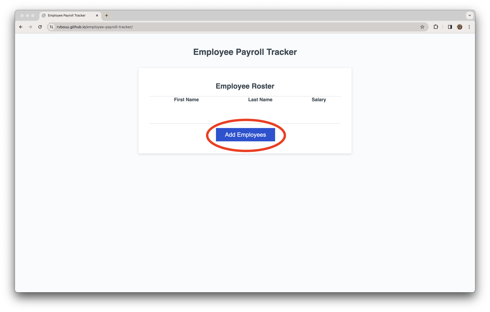
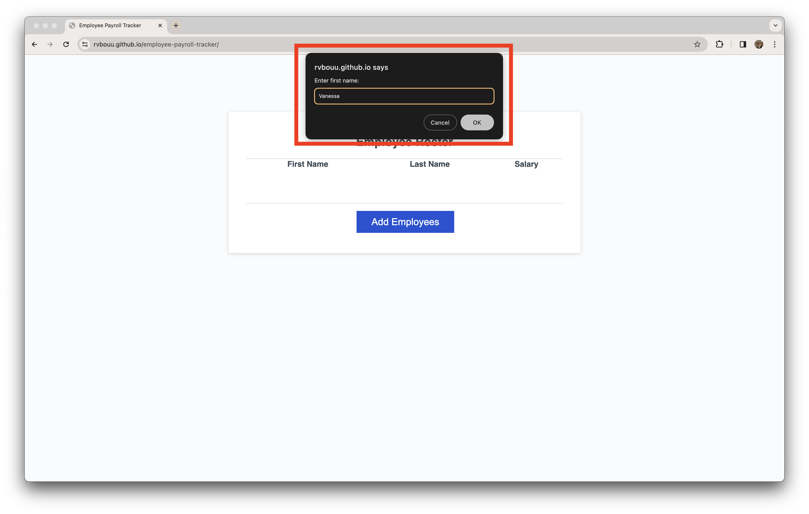
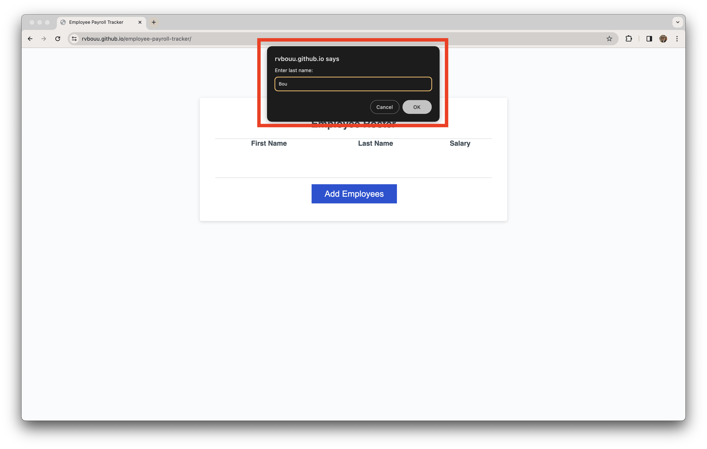
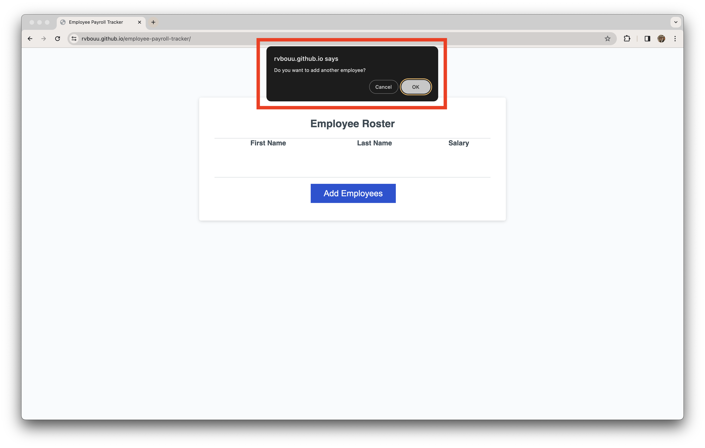
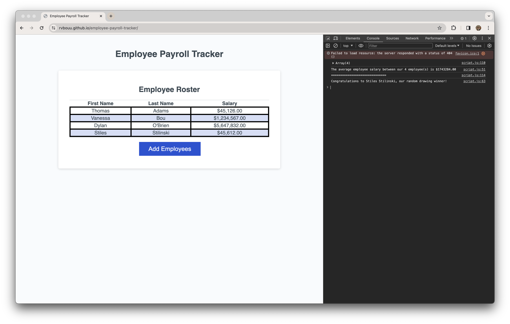
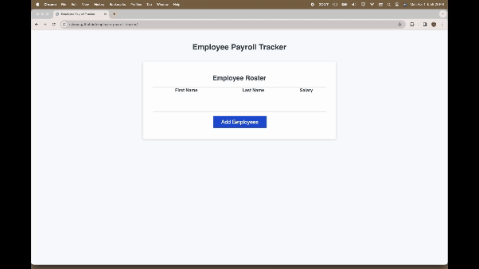

# Employee Payroll Tracker

## Description

This Employee Payroll Tracker application has a modified code that enables a payroll manager to view and manage payroll data. The app runs in browswer and the HTML and CSS are updated dynamically by the JavaScript code that I have modified.

## Usage

By clicking on the "Add Employees" button,

You will be prompted to fill out three pieces of employee information, their first name,

last name,

and salary.
 
Once completed, you will be asked if you would like to add more employees.

Once you have filled out all employees' information, you will be shown a table with all of the data you have inputted in alphabetical order. When you open the DevTools console, you will see more information about the entered data.

## Screenshot

## Deployed Application

[Click here](https://rvbouu.github.io/employee-payroll-tracker/) to view the deployed version.